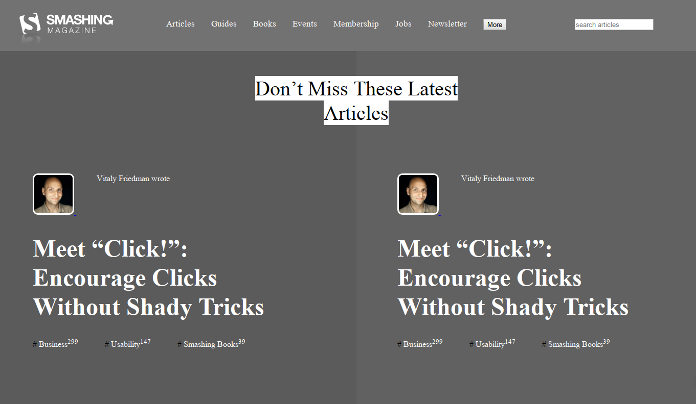

# design-teardown
> design-teardown is a simple project and consisted to build a page which matches wich apart the website for a popular design magazine called the Smashing Magazine(www.smashingmagazine.com)

Additional description about the project and its features.goy

## Built With

- HTML,
- CSS

## Live Demo

[Live Demo Link](https://rawcdn.githack.com/sipe-daniel/design-teardown/cce394c55269d818df905eafde7a31985d30c489/index.html)

## Author

👤 **Daniel Jordan Sipe Tchawou**

- Github: [@githubhandle](https://github.com/sipe-daniel)
- Linkedin: [linkedin](https://linkedin.com/in/daniel-jordan-sipe-tchawou)

## Show your support

Give a ⭐️ if you like this project!

